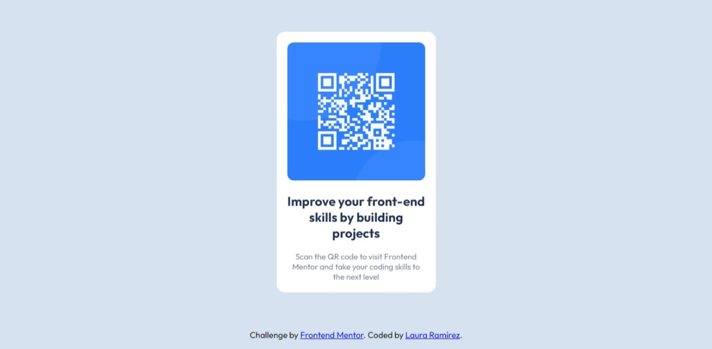

# Frontend Mentor - QR code component solution

This is a solution to the [QR code component challenge on Frontend Mentor](https://www.frontendmentor.io/challenges/qr-code-component-iux_sIO_H). Frontend Mentor challenges help you improve your coding skills by building realistic projects. 

## Author

- Laura Tatiana Ramírez Rodríguez
- Frontend Mentor - [@laura1809](https://www.frontendmentor.io/profile/laura1809)

### Screenshot

### Links

- Solution URL: [https://laura1809.github.io/QR-code-component/](https://laura1809.github.io/QR-code-component/)

### Built with

- HTML
- CSS 

